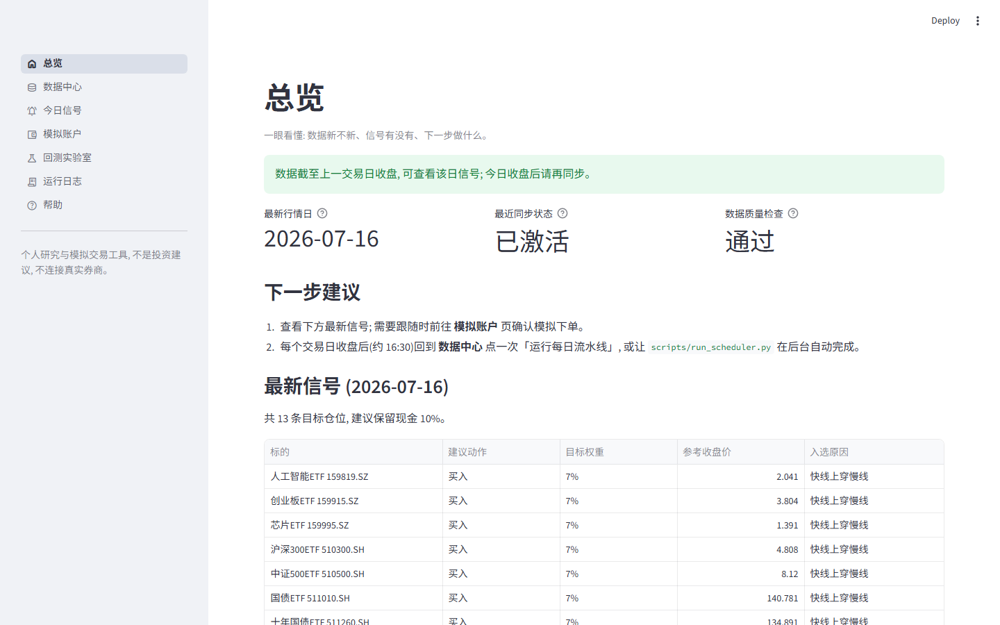
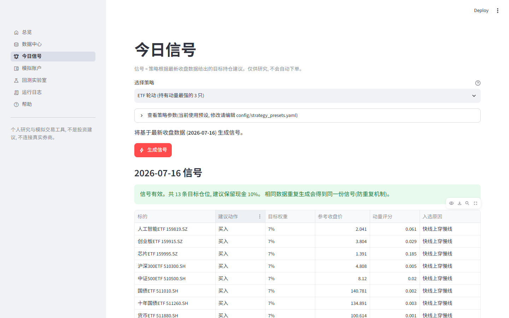
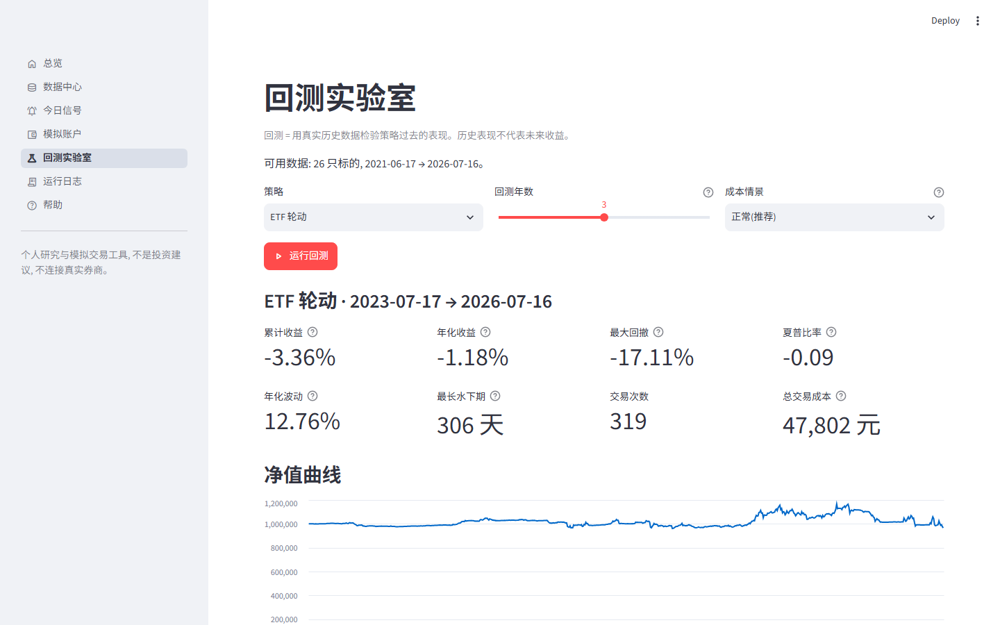
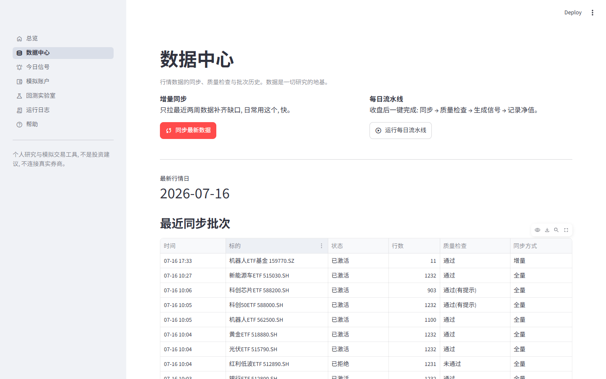

<div align="center">

# ETF Quant Lab

**A local-first quantitative research & paper-trading workbench for China A-share ETFs (daily frequency)**

English | [简体中文](README.md)

Data sync · Quality gate · Backtesting · Daily signals · Paper trading — all on your own machine



</div>

---

## What is this

ETF Quant Lab is a local quant tool for individual researchers, covering the full daily-frequency loop for A-share ETFs:

```
market data sync → quality gate → backtest → daily signal → paper order → NAV tracking
```

It is deliberately simple and honest:

- **Local-first**: your data lives on your machine (DuckDB + Parquet); the UI binds to 127.0.0.1 only, telemetry disabled.
- **No real money**: no broker connection, no auto-trading; a paper account with virtual cash tracks signal performance.
- **No self-deception**: strict look-ahead prevention (decide on T close, execute at T+1 open), mandatory cost assumptions, and a quality gate that can never be bypassed — bad data is rejected rather than mixed into backtests.

> ⚠️ For learning and research only. Nothing here is investment advice; past backtest performance does not predict future returns.

## Features

| Page | What it does |
|---|---|
| Overview | Data freshness, quality status, latest signal — "what should I do today" at a glance |
| Data Center | One-click incremental sync / daily pipeline; batch history and quality issues fully auditable |
| Today's Signal | Target-portfolio suggestions from the latest close, each with its selection reason |
| Paper Account | Virtual-cash positions following signals, T+1 rules, independently recomputable ledger |
| Backtest Lab | Honest backtests on real history with cost scenarios; 8 metrics incl. return/drawdown/Sharpe |
| Run Logs | Execution records and audit events for every task |

### Screenshots

<details>
<summary><b>Today's Signal</b> — every suggestion carries target weight, reference price and reasons</summary>


</details>

<details>
<summary><b>Backtest Lab</b> — cost-aware backtesting with hover explanations on every metric</summary>


</details>

<details>
<summary><b>Data Center</b> — transparent batch lifecycle and quality-gate outcomes</summary>


</details>

## Design highlights

- **Data integrity first**: append-only raw snapshots, atomically published canonical layer, SHA-256 checksums; quality rules (duplicates / future dates / calendar gaps / extreme jumps / staleness) reject the whole batch on failure.
- **Consistent price adjustment**: QFQ (forward-adjusted) by default to neutralize fund share splits; incremental syncs automatically follow the adjustment basis of existing history.
- **Look-ahead prevention**: strategies can only see data up to the as-of date — crossing the boundary raises immediately; identical inputs reproduce bit-identical outputs (locked by golden regression tests).
- **Idempotency everywhere**: 4-part signal keys, natural order keys, per-date NAV upserts — duplicate clicks or scheduler runs never create duplicate data.
- **Network resilience**: browser user-agent patch, proxy/direct fallback, source failover, exponential backoff.
- **Engineering quality**: 290+ tests (unit/integration/regression), strict mypy, layered architecture (contracts / domain / services / storage / ui with one-way dependencies).

## Quick start

Requires Python 3.12+ and [uv](https://docs.astral.sh/uv/).

```bash
# 1. Install dependencies
uv sync --all-groups

# 2. Initialize directories and database (idempotent)
uv run python -m etf_quant_lab.cli init

# 3. First full sync (5 years of history for the default universe via AKShare — no token needed)
uv run python scripts/bootstrap_market_data.py

# 4. Launch the UI (opens at http://127.0.0.1:8510)
uv run streamlit run app.py
```

The in-app Help page assumes you are new to quant trading and explains every concept — start there. (UI text is currently Chinese.)

### Daily routine

After each trading day's close (~16:30 CST), pick one:

```bash
# Option A: in the UI — click "Run daily pipeline" on the Data Center page
# Option B: one-shot CLI
uv run python scripts/run_scheduler.py --once
# Option C: resident scheduler — runs automatically at 16:30 on trading days
uv run python scripts/run_scheduler.py
```

### Optional configuration

- **Tushare source**: copy `.env.example` to `.env` and fill in `EQL_TUSHARE_TOKEN` (requires fund_daily permission). Without it, AKShare is used with identical functionality.
- **Universe**: edit `config/universe.yaml` (26 ETFs by default: broad-market, semiconductor, robotics, new-energy, healthcare, defense and more).
- **Strategy parameters**: edit `config/strategy_presets.yaml`.
- **Cost scenarios**: edit `config/cost_scenarios.yaml` (ideal / normal / pessimistic).

## Built-in strategies

| Strategy | Idea |
|---|---|
| ETF Rotation | Rank by risk-adjusted momentum, hold the strongest N; rotates into defensive assets when momentum fades |
| Trend Baseline | Fast/slow moving-average filter, equal-weight above trend — serves as the benchmark |

The strategy interface is purely functional (as-of data slice in, target portfolio out). Add your own by implementing the `Strategy` protocol and registering it — look-ahead checks and weight validation are enforced by the framework.

## Development

```bash
uv run pytest            # 290+ tests, 85% coverage floor
uv run ruff check .      # lint
uv run mypy src          # strict type checking
```

Layered architecture (dependencies point one way, downward):

```
app_pages/ (Streamlit pages)
   └─ ui/ (presenters, framework-free, independently testable)
       └─ services/ (data sync / signal / backtest / paper / pipeline)
           └─ domain/ (strategies / risk / rebalance / execution, pure functions)
               └─ contracts/ (data contracts and enums)
           └─ storage/ (DuckDB + Parquet)
```

## Safety boundaries

- Connecting to real brokers or auto-placing orders is **strictly out of scope** — no live-trading interface exists in the codebase.
- All market and account data stays local; nothing is uploaded anywhere.
- Streamlit telemetry is off; the server binds to 127.0.0.1 only.

## License

[MIT](LICENSE)
